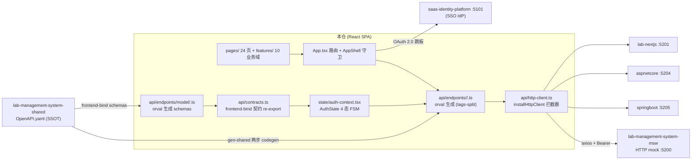
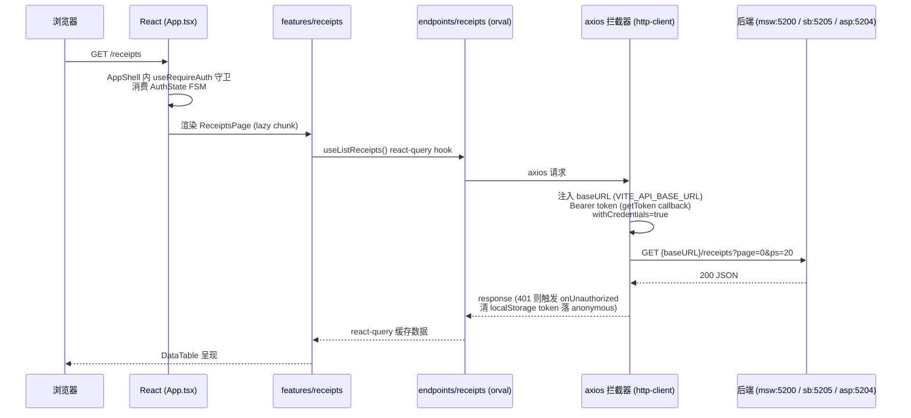

# lab-management-system-react 架构

> 一句话定位：lab-management-system 家族的 React 前端仓——镜像 nextjs 仓的 26 页 UI，只消费不实现 `/api`；API 客户端与类型全部来自 shared 契约仓的两步 codegen，后端地址走 env-driven 单 URL。

生成日期：2026-09-22 ｜ 锚定 HEAD：ae65ea3 ｜ 生成方式：DeepWiki 风格架构扫描

## 1. 总览

- **家族角色**：前端仓（6 角色之一）。lab-management-system 家族 = shared 契约仓（dual SSOT）+ msw mock 仓 + 多前端（react / vue / nextjs）+ 多后端（aspnetcore / springboot）+ contract-test 黑盒校验仓 + e2e 仓。本仓是 react 实现，**不写任何后端 route**（CLAUDE.md 铁律：禁止加 `src/app/api/*/route.ts`）。
- **技术栈**（钉死于 `version-lock.json`）：React 19 + TypeScript 5.7 + Vite 8 + react-router-dom 7 + @tanstack/react-query 5 + axios（orval 生成）+ Tailwind v4 + shadcn/ui（Radix）+ Vitest 4 + Testing Library。
- **规模速览**：`src/` 304 个 ts/tsx 文件；`src/pages/` 24 个页面组件；`src/api/endpoints/` 13 个 tag 目录（12 业务 tag + `model/` schemas）；`src/features/` 10 个业务域；`tests/` 36 个测试文件。
- **页面分组**（`App.tsx` 注释即交付批次）：Batch 1 基础数据码表 4 页（models / specifications / grades / brands）→ Batch 2A 合同类 3 页（contracts / report-names / param-interfaces）→ Batch 2B 流程线（receipts / task-assignment / data-entry）+ 检测能力 6 薄页（inspection-*）+ 报告 4 阶段（report-issue / review / approve / archive）→ Batch 2B-5 汇总（summary）；另有 Dashboard 与 `/receipts/:id` 详情页。业务页全部 lazy import + `PageLoading` 加载态。
- **版本与放行**：依赖钉死 `version-lock.json`；tag 即放行——全量回归绿后打 `v<MAJOR>.<MINOR>.<PATCH>-<YYYYMMDD>` 形式 tag（如 `v0.3.11-20260826`）。
- **双身份**：书稿配套仓（书稿代码块 source of truth）+ harness 门禁仓。

## 2. 系统架构

关键边界解读（按重要性）：

1. **API 面只认生成物**（suite 硬规则 §4）：本仓不手写任何端点调用函数，`src/api/endpoints/` 整目录由 orval 拥有（`clean` 配置保证 regen 前清空，从契约移除的 tag 不留死 hooks；手写文件只放 `src/api/` 下，不得混入）。
2. **后端可替换**：react / vue / nextjs 三个前端对着同一份 OpenAPI 契约，可分别指向 msw / springboot / aspnetcore / nextjs 任一后端；本仓默认指向 nextjs（:5201），vue 仓默认 aspnetcore（:5204），约定见 `.env.example` 注释。
3. **登录不自己实现**：`/login` 是 SSO orchestrator（2026-08-18 认证收口砍表单+选租户页），认证委托给 saas-identity-platform（OAuth 2.0 跳板 + code 回调），lab 前端只持有 token 并维护本地 AuthState FSM。
4. **dev 期 saas 代理**：Vite dev server 把同源 `/api/saas/*` 重写转发到 saas 真实 `/api/v1/*`，浏览器看不到 CORS preflight（`vite.config.ts` proxy 块）。
5. **手写/生成二分**：手写层只有 `src/api/` 下的 `http-client.ts`（拦截器）、`backend-config.ts`（单 URL）、`contracts.ts`（frontend-bind 类型 re-export + 行为签名）三个文件；其余 API 面全是生成物。

## 3. 模块分解

| 模块/目录 | 职责 | 关键文件 |
|---|---|---|
| `src/api/endpoints/` | orval tags-split 生成物：按 shared `@tag` 拆 12 个业务 tag（auth / receipts / samples / contracts / inspection-* 等）+ react-query hooks；**整目录 orval 拥有，禁手改** | `<tag>/<tag>.ts`、`model/<schema>.ts`、`param-interfaces/` |
| `src/api/`（手写层） | axios 拦截器装配（baseUrl + Bearer + 401 回调 + withCredentials）、env 单 URL 读取、frontend-bind 契约类型 re-export | `http-client.ts`、`backend-config.ts`、`contracts.ts` |
| `src/state/` | 认证状态：模块级 store 为真相、React Context 为视图；AuthState 4 态 FSM（idle→anonymous→awaiting_tenant→authenticated）；路由守卫 | `auth-context.tsx`（402 行）、`require-auth.ts` |
| `src/pages/` | 24 个页面组件，路由级 lazy import（Sprint 2 按 Batch 1→4 落地） | `ReceiptsPage.tsx`、`LoginPage.tsx`、`DashboardPage.tsx` 等 |
| `src/features/` | 10 个业务域的组件与数据获取逻辑（receipts / reports / inspection-capability / data-entry / summary 等） | `receipts/ReceiptsList.tsx`、`receipts/ReceiptDetail.tsx` |
| `src/components/` | `app/`：AppShell、侧栏、菜单（saas `/me/menus` 驱动）、DataTable、ConfirmDialog 等布局原语；`ui/`：15 个 shadcn/ui 原语 | `app/app-shell.tsx`、`app/menus.ts`、`ui/table.tsx` |
| `src/lib/` | env 集中读取（未设→fallback、空串→显式空二分）、工具与重定向消毒 | `env.ts`、`utils.ts`、`sanitize-redirect.ts` |
| `src/data/` | 模板索引生成物与文档模板资产（docx 预览/填充用 devDeps：docxtemplater + pizzip + docx-preview） | `generated/`、`templates/` |
| `scripts/` | shared 两步 codegen 编排 + ADR-0026 同步 marker 落盘 | `gen-shared.ts`（76 行）、`gen-template-index.mjs` |
| `tests/` | 36 个测试：auth FSM、endpoints 冒烟、组件 DOM 测试、fnReporter 功能 ID 上报 | `auth-fsm.test.ts`、`endpoints-smoke.test.ts`、`fnReporter.ts` |

分层纪律（CLAUDE.md 铁律摘录）：组件内禁止直接 fetch（必须走 `src/api/` orval 具名函数）；禁止 import shared TS 客户端（只认生成物）；localStorage 统一走 `src/store/` 约定（token key 全部来自契约常量 `TOKEN_STORAGE_KEYS`，`lab.*` 前缀）；禁 `window.confirm/alert`（走 ConfirmDialog / sonner）；禁手写 UI 原语样式类与裸颜色（只用 `src/components/ui/` + Tailwind 语义 token）；lab 组件自研，禁复制 saas 仓组件源码。

## 4. 数据流 / 请求生命周期

代表性链路：**一次页面加载到数据呈现（凭证列表）**。

补充：`installHttpClient` 在 `main.tsx` 启动时调一次且**幂等**（`interceptorsInstalled` ref 单例，重复调用只刷新 getToken/onUnauthorized 回调），避免拦截器叠加导致旧闭包的过期 token 盖掉新 token。SSO 登录链路（LoginPage）：无回调参数 → 后端 `/api/auth/sso/authorize` 拿 authorizeUrl 跳 saas → saas 登录后带 code 回 `/login` → 后端换 token → 前端存 `lab.accessToken` 进 FSM。

其他约定链路：

- **分页**：本仓列表走 **1-based** 分页（如 `src/features/receipts/ReceiptsList.tsx` 初始 `page: 1, pageSize: 50`；`components/app/pagination-bar.tsx` 以 `page <= 1` 判首页）。
- **鉴权失效**：任一请求 401 → 拦截器回调清全部 `TOKEN_STORAGE_KEYS` → FSM 落 anonymous → `useRequireAuth` 守卫消费状态变化重定向 `/login`（拦截器不直接跳路由）。
- **vite proxy（saas 跨源豁免）**：dev 期浏览器请求同源 `/api/saas/*`，Vite 重写为 saas 的 `/api/v1/*` 转发（`SAAS_BASE_URL`，默认 :5101），浏览器不感知 CORS；生产走 nginx 反代同源化。

## 5. 依赖面

- **shared 契约仓（唯一 API SSOT）**：`npm run gen:shared`（即 `scripts/gen-shared.ts`）两步——(1) 在 shared 仓跑 `npm run emit:openapi` 产出 `generated/openapi/openapi.yaml`；(2) 本仓 `npx orval` 按 `orval.config.ts`（mode=tags-split，client=react-query，clean=endpoints 目录）生成，再 `prettier --write` 保证 byte-idempotent。结束后写 `.state/last-gen-shared.json` marker（ADR-0026，同 sha 零写入）。`frontend-bind-meta` tag 被 orval exclude（emit-only 锚点，后端不实现，调用必 404）；其 8 个契约 schema 经 `src/api/contracts.ts` re-export 消费。改了 shared 必须重跑 `gen:shared`（`prebuild` 也自动跑）。
- **家族其他仓**：msw mock 仓提供 ADR-0012 B 强度独立 HTTP 后端（:5200，非 Service Worker 模式；`vite.config.ts` 的 `optimizeDeps.exclude` 保留 msw 浏览器加载豁免）；nextjs 仓是 UI 镜像来源（`../lab-management-system-nextjs/src/`，26 页逐批镜像）；与 saas-identity-platform 通过 OAuth 2.0 SSO 跳板互认（`VITE_SAAS_BASE_URL` + `VITE_SAAS_CLIENT_ID`，token 不跨仓共享，各自持有）。
- **外部依赖**：生产部署为 nginx:alpine 容器 + VPS nginx 反代（`deploy/lab-management-system-react.sh`、`deploy/nginx-vps.conf.example`、`Dockerfile`，host 端口走 lab 家族 5202 段）。无直连 DB。

## 6. 配置与部署

env 变量表（模板 `.env.example`，复制为 `.env.local`；本仓有默认值——dev 离线可跑，`src/lib/env.ts` 区分「未设→fallback」与「空串→显式空」，但 `VITE_SAAS_CLIENT_ID` 缺失时 LoginPage 按 ADR-0019 **fail-fast throw**，禁 UUID 字面兜底）：

| key | 用途 | 缺失时行为 |
|---|---|---|
| `VITE_API_BASE_URL` | 后端单 URL（ADR-0014 废弃运行时切后端）。默认 `http://localhost:5201`（真 nextjs）；切 springboot 填 :5205、aspnetcore 填 :5204、msw 填 :5200 | 默认值（`.env.test` 设空串 → 相对 URL 供 setupServer 拦截） |
| `VITE_API_MODE` | 后端显示标签（仅 UI 展示，不参与路由） | 默认 `nextjs` |
| `VITE_DEV_PORT` | Vite dev server 端口 | 默认 5202 |
| `VITE_SAAS_BASE_URL` | saas SSO 跳板地址（前端侧） | 默认 `http://localhost:5101` |
| `SAAS_BASE_URL` | 同上（msw handler / vite proxy 进程侧读取） | vite proxy 兜底 5101 |
| `VITE_SAAS_CLIENT_ID` | OAuth client_id（须与 saas `oauth_client.client_id` 一致；UUID 值会被 aspnetcore authorize 判 401） | **fail-fast throw**（ADR-0019） |

部署：`Dockerfile`（node:24-alpine builder + nginx:alpine runtime，EXPOSE 80，内置 `/` 健康检查）；`deploy/lab-management-system-react.sh` 负责 host :5202 映射、nginx vhost 自举（模板从 master 拉取，`sites-available` symlink + `nginx -t` + reload，ADR-0018 SPA partial 双层）与 reload。

- **构建产物**：`npm run build` = `prebuild`（自动 `gen:shared`）→ `tsc --noEmit` → `vite build`；产物为纯静态 SPA，容器内由 nginx 托管，无 SSR、无 Node 运行时。
- **测试 env**：`src/lib/env.ts` 支持测试注入——`.env.test` 设 `VITE_API_BASE_URL=` 显式空串 → fetch 走相对 URL，由 `@mswjs/node` setupServer 拦截（`tests/setup.dom.ts` / `global-setup.ts`）。
- **校验闭环**：本仓黑盒行为由家族 contract-test 仓跨后端校验、e2e 仓做用户旅程验证；本仓自身只负责 L1-L4 单元面（见 §7）。

## 7. 质量门禁

来自 `.harness/stack.json`（suite `scripts/gate.py -p lab-management-system-react`，exit code 语义：0 = 过；1 = 按修复提示回代码；2 = 契约/环境问题，停下问人）：

| 门 | 名称 | 命令 |
|---|---|---|
| L1 | 格式 | `npx --no -- prettier --check src tests` |
| L2 | 静态检查 | `npx --no eslint src tests` |
| L3 | 类型 | `npx --no tsc --noEmit` |
| L4 | 测试 | `npx --no vitest run`（trace_cmd 同，`trace_env: TRACE_MAP=1`） |

配套铁律：TDD 先红后绿；功能清单（function-tree）是锚点，改树走 `/tree-change` 且同 commit；测试标题禁写 `Mxx.Fxx.Ixx` 字面（防 fnReporter 误吸 regression anchor）；trace 由 `trace_cmd` 产出（`TRACE_MAP=1 vitest run`），`.state/trace.json` 禁手写。

---

*本文档由架构扫描生成；仓内事实如与本文冲突，以代码为准。修订方式：改本文并同 commit 说明依据。*
